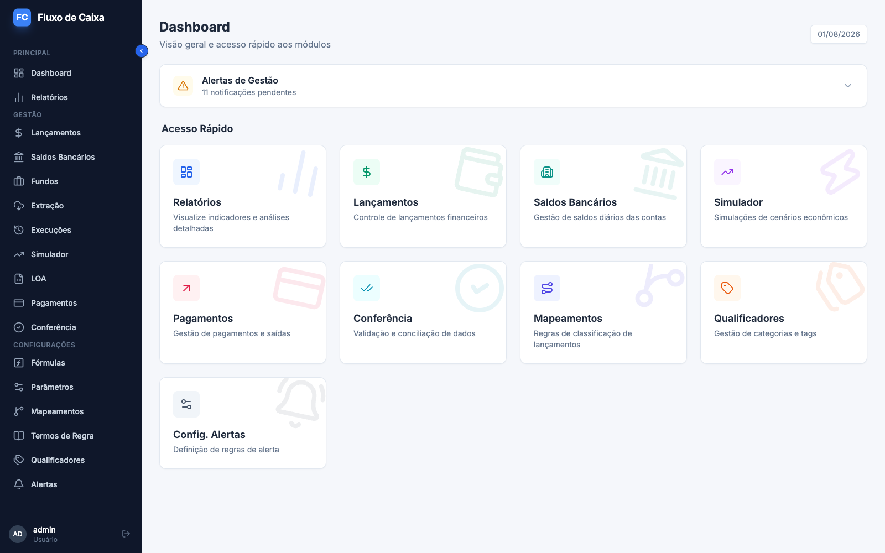
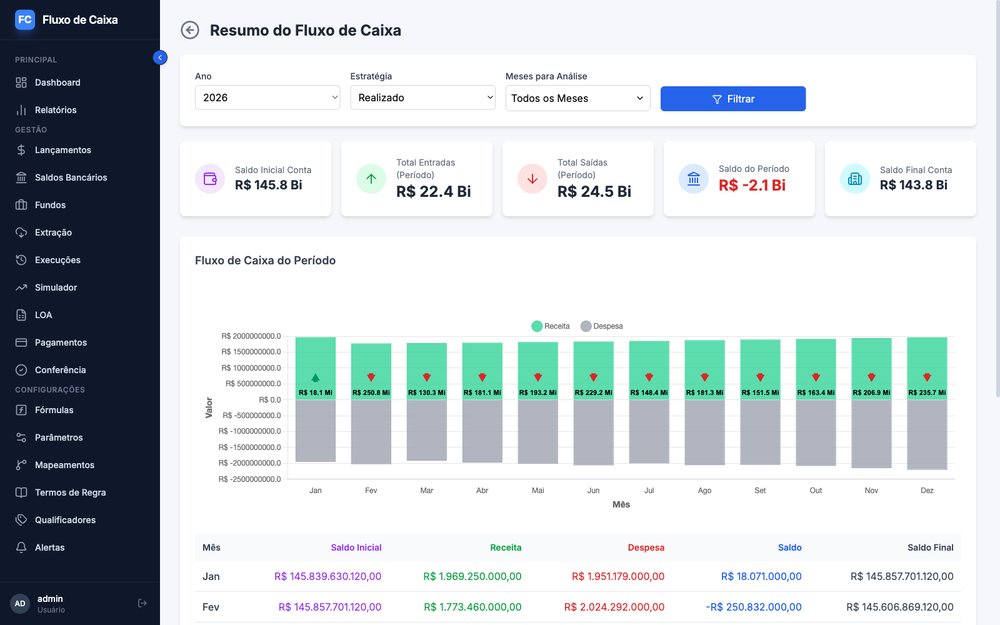
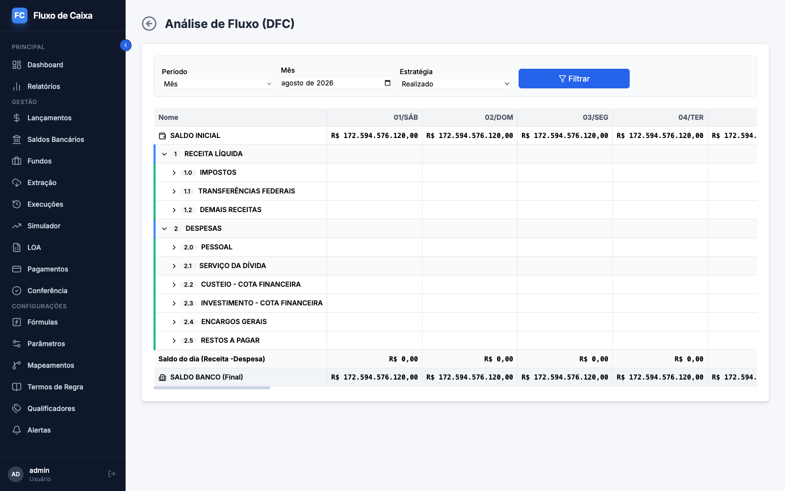
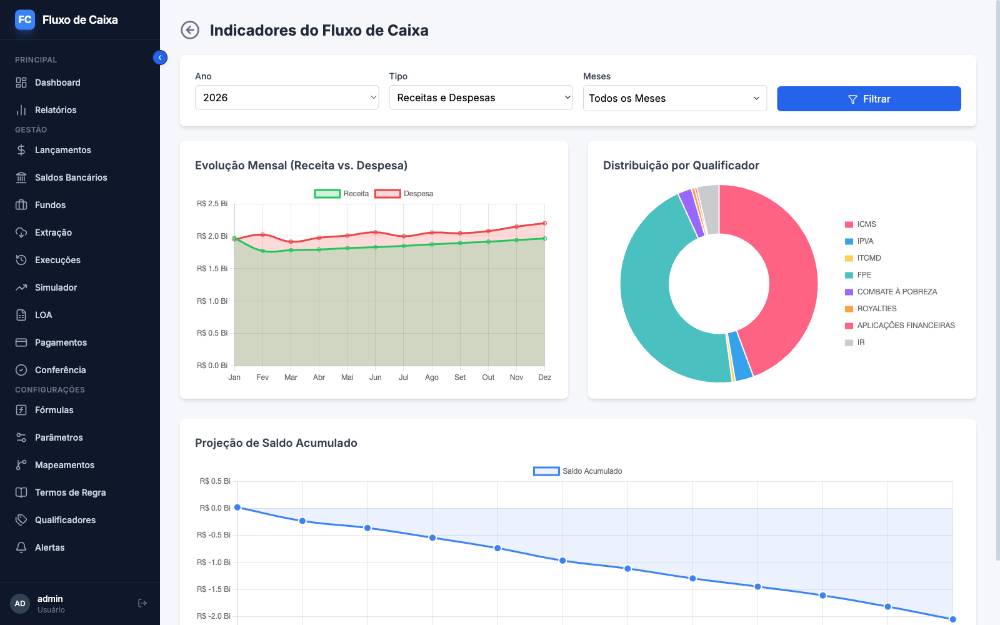
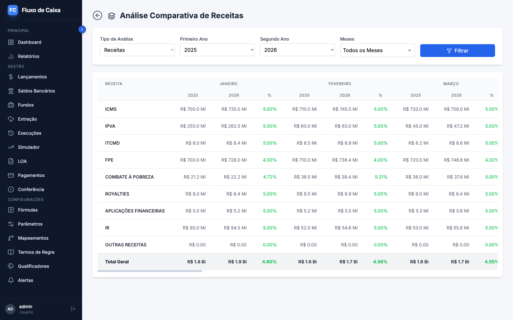
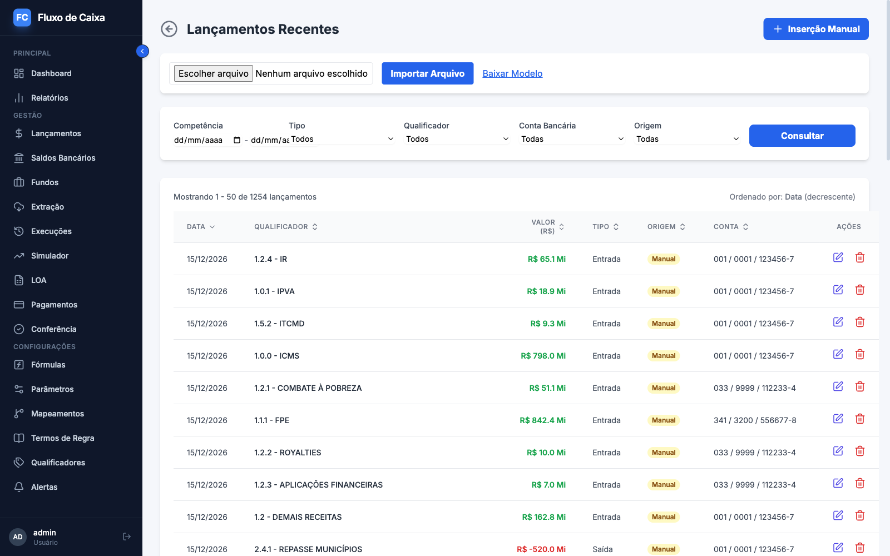
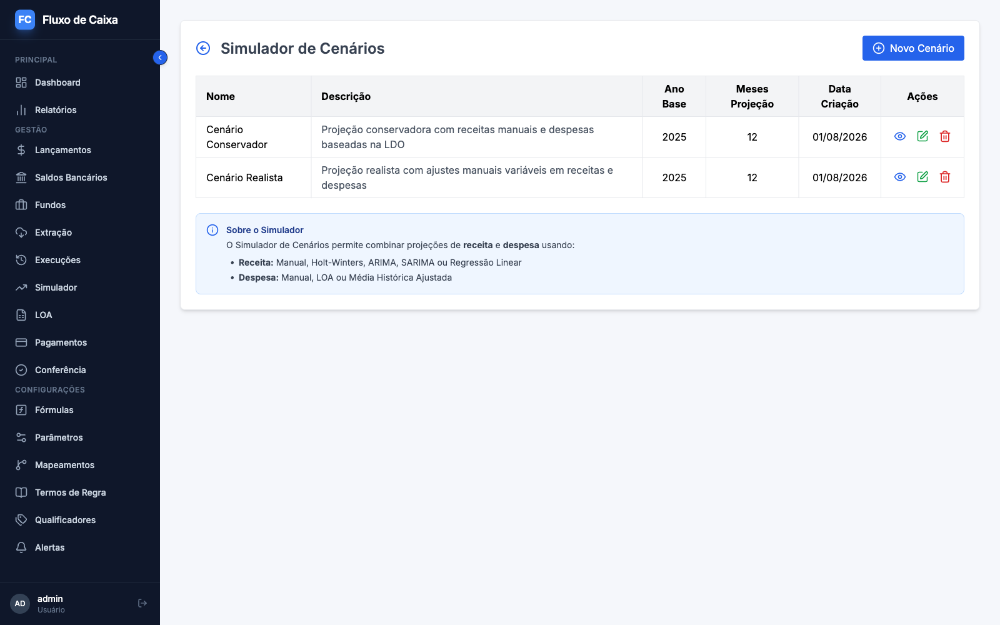
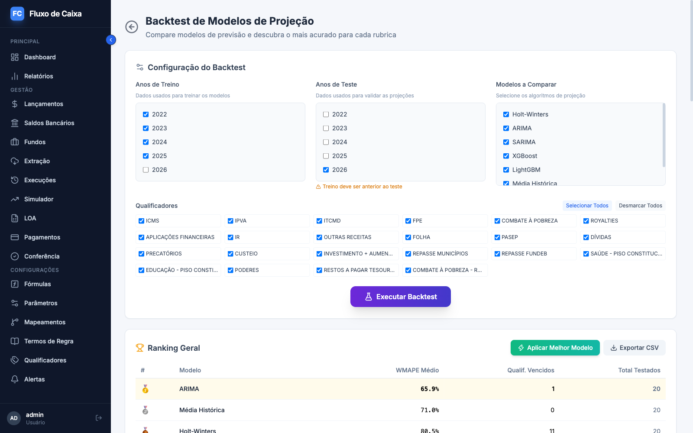
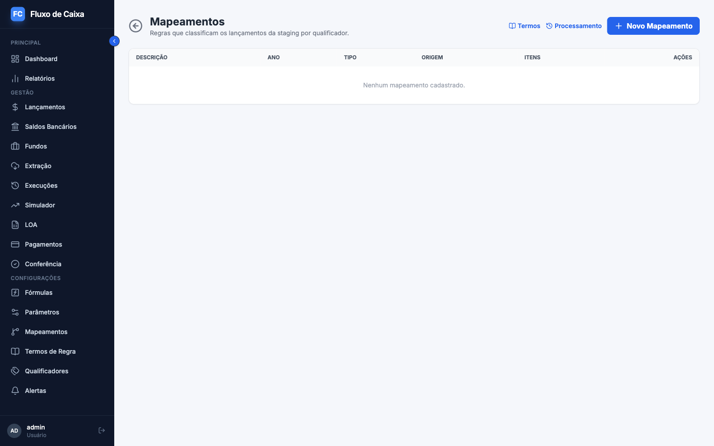
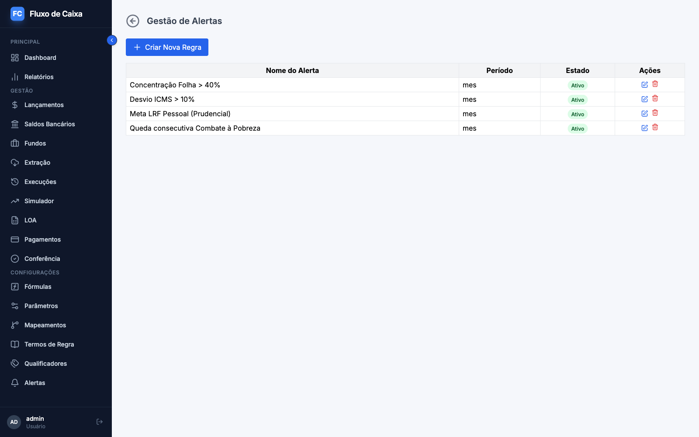

# Fluxo de Caixa

Sistema web de gestão de fluxo de caixa para tesourarias do setor público — secretarias de fazenda estaduais, prefeituras e órgãos públicos em geral. Código aberto sob licença MIT, pensado para ser adotado e adaptado por qualquer ente.

O sistema cobre o ciclo completo da tesouraria: registra a movimentação diária, consolida saldos bancários por conta e por fundo, produz os relatórios gerenciais (DFC, KPIs, indicadores) e projeta receitas e despesas com modelos estatísticos e de aprendizado de máquina — comparando-os por acurácia para recomendar o mais adequado a cada rubrica.

**Princípio de produto: tudo é parametrizável por cadastro.** Cada órgão tem seus bancos, seus sistemas de origem e seus layouts de arquivo. Nada disso é código fixo — plano de contas, regras de classificação, fontes de extração e fórmulas de projeção são configurados pela interface. O sistema também é *self-contained*: não exige Airflow, Redis, fila de mensagens ou qualquer infraestrutura externa. Sobe com Python e um banco.

### Em números

| | |
|---|---|
| **Backend** | FastAPI + SQLAlchemy 2.0, templates Jinja2 renderizados no servidor (não é SPA) |
| **Banco** | SQLite por padrão, PostgreSQL via `DATABASE_URL`; schema versionado com Alembic |
| **Previsão** | Holt-Winters, ARIMA, SARIMA, XGBoost, LightGBM, média histórica, fórmulas paramétricas e LOA |
| **Integração** | Extração embutida por FTP/SFTP, API REST e banco SQL, com motor de regras em português |
| **Testes** | Suíte pytest com cenários BDD em Gherkin pt-BR, mais testes E2E em Playwright |

## 📸 Demonstração Visual

**Dashboard** — visão geral com acesso rápido aos módulos e alertas pendentes.



**Resumo do fluxo de caixa** — entradas, saídas e saldo do período, com a projeção do cenário ativo sobreposta ao realizado.



**Análise de Fluxo (DFC)** — demonstração dos fluxos de caixa em árvore hierárquica, com colunas por dia ou por mês, saldo inicial e final, e drill-down até o lançamento.



**Indicadores** — painel de acompanhamento da execução financeira.



**Análise comparativa** — confronto entre períodos e entre previsto e realizado.



**Lançamentos** — consulta com filtros por competência, tipo, qualificador, conta e origem, além de importação por planilha.



**Simulador de cenários** — cenários de projeção combinando modelos distintos para a perna de receita e a de despesa.



**Backtest de modelos** — compara os algoritmos de previsão sobre dados históricos e aponta o mais acurado por rubrica, com ranking por erro percentual.



**Mapeamentos** — regras em português que classificam automaticamente a movimentação vinda dos sistemas de origem.



**Alertas** — regras de acompanhamento sobre saldos, rubricas e desvios entre projetado e realizado.




## 🌐 Página do Projeto e Comunicação

Acompanhe novidades e o código mais recente em [https://github.com/heliojunior1/fluxocaixa-publico](https://github.com/heliojunior1/fluxocaixa-publico). Se o serviço estiver em execução no Render, acesse [https://fluxodecaixa-1kxt.onrender.com/](https://fluxodecaixa-1kxt.onrender.com/) — a primeira requisição pode levar cerca de um minuto, porque a instância hiberna quando ociosa.

Para dúvidas ou sugestões, abra uma [issue](https://github.com/heliojunior1/fluxocaixa-publico/issues).

## 🚀 Como Executar o Projeto

### Pré-requisitos

- **Python 3.10 ou 3.11.** O código usa a sintaxe de união de tipos do PEP 604 (`int | None`), que exige 3.10 no mínimo; o teto em 3.11 está declarado no `pyproject.toml` e é a faixa em que a suíte roda. Versões mais novas podem instalar dependências científicas de major diferente do testado.
- **pip** (ou [uv](https://github.com/astral-sh/uv), que resolve bem mais rápido).

### 1. Clone o Repositório
```bash
git clone https://github.com/heliojunior1/fluxocaixa-publico.git
cd fluxocaixa-publico
```

### 2. Criação do Ambiente Virtual

**Importante**: Sempre use um ambiente virtual para isolar as dependências do projeto.

#### No Windows (PowerShell ou CMD):
```powershell
# Criar ambiente virtual
python -m venv venv

# Ativar ambiente virtual (PowerShell)
.\venv\Scripts\Activate.ps1

# OU ativar ambiente virtual (CMD)
venv\Scripts\activate.bat
```

#### No Linux/Mac:
```bash
# Criar ambiente virtual
python -m venv venv

# Ativar ambiente virtual
source venv/bin/activate
```

### 3. Instalação das Dependências

Com o ambiente virtual ativado:

```bash
pip install -r requirements.txt
```

A instalação traz o stack científico (NumPy, pandas, scikit-learn, statsmodels, XGBoost e LightGBM) e leva alguns minutos na primeira vez.

> **macOS**: XGBoost e LightGBM dependem da biblioteca OpenMP. Se a importação falhar com erro de `libomp`, instale-a com `brew install libomp`. O sistema continua funcionando sem ela — apenas os modelos que a exigem ficam indisponíveis, sem derrubar os demais.

### 4. Executar a Aplicação

#### Opção 1: Usando Python diretamente (RECOMENDADO)
```bash
python app.py
```

#### Opção 2: Usando Uvicorn com PYTHONPATH
```bash
# Windows PowerShell
$env:PYTHONPATH = "src"
uvicorn fluxocaixa.main:app --reload --host 0.0.0.0 --port 8000

# Linux/Mac
export PYTHONPATH=src
uvicorn fluxocaixa.main:app --reload --host 0.0.0.0 --port 8000

# Windows CMD
set PYTHONPATH=src
uvicorn fluxocaixa.main:app --reload --host 0.0.0.0 --port 8000
```

#### Opção 3: Executar a partir da pasta src
```bash
cd src
uvicorn fluxocaixa.main:app --reload --host 0.0.0.0 --port 8000
```

**Nota sobre Gunicorn no Windows:** O Gunicorn não funciona nativamente no Windows devido à dependência do módulo `fcntl`. Para desenvolvimento local no Windows, use as opções 1 ou 2. O Gunicorn é usado apenas em produção (Linux) no Render.com.

### 5. Acessar a Aplicação

Após iniciar o servidor, acesse:
- **Aplicação**: http://localhost:8000
- **Documentação da API**: http://localhost:8000/docs
- **Inicializar BD**: http://localhost:8000/init-db

## 📋 Inicialização do Banco de Dados

O projeto usa SQLite como banco de dados padrão (PostgreSQL suportado via `DATABASE_URL`). Na primeira execução:

1. **Inicialização automática**: o schema é criado/atualizado automaticamente na pasta `instance/` via migrações Alembic
2. **Dados de exemplo**: são carregados automaticamente no boot (veja `SEED_DEMO_DATA` abaixo)
3. **Recriar banco**: para começar do zero, acesse http://localhost:8000/recreate-db (exige login e `APP_ENV=dev`)

## 🗄️ Migrações de Banco (Alembic)

O schema é versionado com [Alembic](https://alembic.sqlalchemy.org/). Toda alteração de
schema é uma revisão em `alembic/versions/` — nunca altere tabelas manualmente.

```bash
# Aplicar migrações manualmente (opcional — o boot já faz isso)
alembic upgrade head

# Criar nova revisão após alterar models
alembic revision --autogenerate -m "descricao-da-mudanca"
```

### Atualizando uma instalação existente (criada antes do Alembic)

Se o seu banco foi criado por uma versão anterior (sem Alembic), execute **uma única vez**:

```bash
alembic stamp 0001   # marca a baseline (equivale ao schema antigo)
```

Depois é só subir a aplicação — o boot aplica as migrações posteriores
automaticamente (`AUTO_MIGRATE`). Sem o stamp, o boot aborta com uma mensagem
explicando exatamente esse comando — nada é alterado no banco.

> ⚠️ Não use `alembic stamp head` na adoção: isso marcaria migrações
> posteriores à baseline como aplicadas sem executá-las.

> 💾 **Faça backup do banco antes de atualizar.** Algumas migrações fazem
> saneamento de dados — a `0004`, por exemplo, deduplica contas bancárias
> repetidas (mantém a mais antiga e reaponta lançamentos/saldos), operação
> que não é revertida pelo downgrade.
> A `0006` migra o saldo legado (`flc_saldo_conta`) para o modelo por fundo
> (fundo `GERAL`) e remove a tabela antiga; o downgrade repovoa a partir do
> `GERAL`, perdendo saldos de outros fundos criados após o upgrade.

## 📤 Importação de arquivos com pré-processamento

Toda importação por tela (saldos, lançamentos, LOA) passa por **pré-visualização**
antes de gravar: você envia o arquivo, revê o veredito linha a linha (ok / aviso /
erro com o motivo) e só então confirma — nada é gravado sem sua confirmação, e
a gravação corresponde exatamente ao que o preview mostrou.

O CSV de **saldos por fundo** aceita dois layouts (detecção automática pelo cabeçalho):

- `Data;Banco;Agencia;Conta;CodFundo;Aplicacoes;Resgates;Saldo` — posição por fundo
  (baixe o modelo em **Saldos Bancários → modelo-csv**);
- `Data;Conta;Valor` (conta `Banco/Agência/Número`) — grava no fundo `GERAL`.

Fundo desconhecido é auto-cadastrado pendente de revisão (avisado no preview);
chave já existente é substituída preservando o histórico.

### Variáveis de ambiente

| Variável | Default | Efeito |
|---|---|---|
| `DATABASE_URL` | `sqlite:///instance/fluxo.db` | URL do banco (SQLite ou PostgreSQL) |
| `AUTO_MIGRATE` | `true` | Executa `alembic upgrade head` no boot. Desative (`false`) em produção com DBA e rode as migrações manualmente |
| `SEED_DEMO_DATA` | `true` | Carrega/restaura os dados de demonstração a cada boot (usado na demo hospedada). **Desative (`false`) ao usar com dados reais** — o seed de demonstração limpa e repopula as tabelas de exemplo |

Os dados de **domínio** (tipos de lançamento, origens, parâmetros globais de fórmulas)
são sempre semeados de forma idempotente e não destrutiva, independente de `SEED_DEMO_DATA`.

## 🔐 Autenticação

Todas as rotas exigem login — **inclusive a documentação OpenAPI (`/docs`)**.
Arquivos estáticos (`/static`) permanecem públicos.

- **Primeiro acesso**: usuário `admin`, senha inicial `admin` (ou o valor de
  `ADMIN_INITIAL_PASSWORD`). O sistema **exige a troca da senha no primeiro login**
  (mínimo 8 caracteres) — exceto em modo de demonstração, descrito adiante.
- **Sessão**: cookie assinado (`HttpOnly`, `SameSite=Lax`), expira em 8 horas.
- Senhas são armazenadas apenas como hash bcrypt.

| Variável | Default | Efeito |
|---|---|---|
| `SECRET_KEY` | *(aleatória por processo)* | Assina o cookie de sessão. **Defina em produção** — sem ela, todo restart derruba as sessões |
| `ADMIN_INITIAL_PASSWORD` | `admin` | Senha inicial do usuário `admin` (só usada na criação; nunca sobrescreve senha existente) |
| `APP_ENV` | *(vazio)* | `prod` liga cookie `Secure`; `dev` habilita a rota destrutiva `/recreate-db` |
| `DEMO_MODE` | `false` | Abre a instância como demonstração pública — ver abaixo |

### Modo de demonstração (`DEMO_MODE`)

Uma instância aberta a visitantes tem um problema que a instalação normal não tem: a troca de senha obrigatória no primeiro acesso faz com que **o primeiro visitante tranque o acesso de todos os seguintes**. Com `DEMO_MODE=true`, três comportamentos mudam em conjunto:

1. A tela de login exibe as credenciais (`admin` / `admin`) e avisa que os dados são fictícios.
2. O `admin` é criado **sem** troca de senha obrigatória — o visitante entra direto.
3. A troca de senha é **recusada**, o que impede que a demo seja sequestrada.

Os três são indissociáveis: sem o terceiro, o segundo apenas adia o problema até alguém trocar a senha por conta própria.

> **Nunca ligue essa flag numa instalação com dados reais.** Ela publica credenciais na tela de login e desabilita a proteção de troca de senha. O default é `false` justamente para que só seja ligada por decisão explícita.

## 👥 Gestão de usuários e permissões (via banco)

**Não há tela de gestão de usuários — por decisão de projeto.** Cada órgão tem
seu próprio sistema de identidade; aqui a gestão é feita
diretamente no banco, com o modelo abaixo. Toda rota exige uma permissão
`FC_<VERBO>_<RECURSO>`; permissões são agrupadas em **perfis** e perfis são
atribuídos a usuários.

| Perfil | Acesso |
|---|---|
| `ADMINISTRADOR` | Total, incluindo administração do banco (`/init-db`, `/recreate-db`) |
| `GESTOR_FINANCEIRO` | Total ao negócio, sem administração do banco |
| `OPERADOR` | Operação diária: lançamentos, saldos, pagamentos, LOA e relatórios (sem exclusões estruturais) |
| `CONSULTA` | Somente leitura e relatórios |
| `EXTRACAO` | Conta de serviço para importações automatizadas |

O usuário `admin` é criado com **todos os perfis**. Sem permissão, o usuário
recebe **403** (e os botões/menus correspondentes ficam ocultos).

A tela **Fundos** (menu Gestão) permite cadastrar fundos manualmente e **aprovar** os auto-cadastrados pelas importações — o item de menu exibe um contador de pendentes para quem tem a permissão de aprovação.

A tela **Contas Bancárias** (menu Cadastros) permite cadastrar, alterar, inativar e reativar contas. A tripla banco/agência/conta fica **imutável** quando a conta já tem saldos ou lançamentos vinculados (corrija criando a conta certa e inativando a errada — o histórico é preservado), e a inativação é bloqueada enquanto houver saldo ativo.

### Criar um usuário

```bash
# 1) Gerar o hash bcrypt da senha
.venv/bin/python -c "import bcrypt; print(bcrypt.hashpw('SenhaForte-123'.encode(), bcrypt.gensalt()).decode())"
```

```sql
-- 2) Criar o usuário (ind_troca_senha='S' força a troca no primeiro login)
INSERT INTO flc_usuario (nom_usuario, nom_completo, txt_hash_senha, ind_troca_senha, ind_status, dat_inclusao)
VALUES ('maria.silva', 'Maria Silva', '<hash-gerado-acima>', 'S', 'A', date('now'));

-- 3) Vincular um perfil
INSERT INTO flc_usuario_perfil (seq_usuario, seq_perfil, dat_inclusao)
SELECT u.seq_usuario, p.seq_perfil, date('now')
FROM flc_usuario u, flc_perfil p
WHERE u.nom_usuario = 'maria.silva' AND p.cod_perfil = 'OPERADOR';
```

### Outras operações

```sql
-- Inativar um usuário
UPDATE flc_usuario SET ind_status = 'I' WHERE nom_usuario = 'maria.silva';

-- Customizar a matriz: remover uma permissão de um perfil
DELETE FROM flc_perfil_permissao
WHERE seq_perfil = (SELECT seq_perfil FROM flc_perfil WHERE cod_perfil = 'OPERADOR')
  AND seq_permissao = (SELECT seq_permissao FROM flc_permissao WHERE cod_permissao = 'FC_IMP_LOA');
```

Customizações são **preservadas**: o seed do boot nunca recria vínculos
removidos nem remove vínculos adicionados pela instalação. O catálogo completo
de permissões está em `flc_permissao` (e em `src/fluxocaixa/auth/catalogo.py`).

## 🔄 Extração embutida (fontes de extração)

O sistema traz um módulo de extração **parametrizável por cadastro**
(`flc_fonte_extracao`): cada fonte aponta para um tipo de conector (plugin
registrado em `src/fluxocaixa/extracao/registry.py`), tem um `json_config`
próprio e, opcionalmente, uma agenda cron. Toda execução — agendada ou
manual (`POST /api/extracao/fontes/{id}/executar`, permissão
`FC_EXEC_EXTRACAO`) — fica registrada em `flc_execucao_extracao` com status
(`SUCESSO`/`PARCIAL`/`ERRO`/`SEM_DADOS`), contadores e detalhe de erros.
Backfill manual: `data_inicio`/`data_fim` juntos, máximo de **90 dias** por
execução. Os conectores de referência (FTP/arquivo, API REST, banco SQL)
chegam nas próximas features.

**Telas** (menu "Extração"): `/extracao/fontes` lista e mantém as fontes
(cadastro com **formulário dinâmico** montado a partir do schema do
conector — campos secretos aparecem mascarados e nunca exibem o valor),
com botões "Testar conexão" e "Executar agora"; `/extracao/execucoes` é o
histórico com semáforo de status, contadores e detalhe de erros por linha.
Cadastrar/editar/inativar exige `FC_MANT_FONTE_EXTRACAO` (perfis
ADMINISTRADOR/GESTOR_FINANCEIRO); o perfil EXTRACAO consulta e executa.

- **`EXTRACAO_DEMO_CONNECTOR`** (default desligado): registra um conector de
  **demonstração** (`DEMO_MANUAL`, gera uma linha de saldo fictícia) para
  E2E e testes locais das telas. É andaime — não é conector de produção;
  deixe desligado em instalação real (a extração real chega com os
  conectores F3.2+).

- **`EXTRACAO_SCHEDULER`** (default `true`): liga o agendador embutido
  (APScheduler) no start do servidor. **Rode com 1 worker** (ver
  `render.yaml`) — com N workers cada processo agendaria as mesmas fontes.
  Para escalar horizontalmente, desabilite a flag e dispare via API.
- **Credenciais nunca no banco**: campos secretos do config aceitam
  referência a variável de ambiente no formato `${NOME_DA_VARIAVEL}`,
  resolvida somente no momento da execução/teste de conexão. Consultas à
  fonte devolvem o placeholder, nunca o valor.
- **Fuso horário do cron**: o agendamento usa o fuso do servidor (variável
  `TZ`).

### Conector de arquivo (`FTP_ARQUIVO`)

Primeiro conector real: lê CSVs entregues por bancos, por **FTP**, **SFTP**
ou **pasta local** (`protocolo` no `json_config`). O `json_config` guarda a
conexão (host, porta, usuário, `senha` como `${VAR}`, `diretorio`,
`padrao_nome` com data — ex.: `{:%Y%m%d}_0001_EXTRATO.csv`); o `json_layout`
guarda o **parser parametrizável**: `separador`, `encoding` (com `utf-8-sig`
para BOM), `formato_data` (strptime), `formato_decimal` (`PT_BR`/`US`),
`header_esperado` (validação estrita opcional — header divergente rejeita o
arquivo inteiro) e o mapeamento de `colunas` (origem por índice/nome →
campo destino) com transformações declarativas (`somente_digitos`,
`codigo_antes_hifen`, `data`, `decimal`). Para cada dia da janela o conector
monta o nome do arquivo e o baixa; **dia sem arquivo é evento esperado**
(fim de semana/feriado) e é pulado. Linha malformada é erro **pontual**
(conta no `PARCIAL`), não derruba o arquivo. Nenhum arquivo na janela ⇒
`SEM_DADOS`. O extrato bancário em arquivo texto é apenas uma configuração de
referência — o conector não conhece banco nenhum, tudo vem do `json_layout`.

> SFTP usa `paramiko` com `AutoAddPolicy` de host key (ambiente self-hosted,
> fonte cadastrada por administrador). Suporte a `known_hosts` fica para
> evolução.

### Conector de API REST (`API_REST`)

Lê a posição de fundos de uma **API REST** de banco. O `json_config` guarda
`url_base`, `path_template` com placeholders (`/v1/saldo/agencia/{agencia}/conta/{conta}`),
`cod_banco`, a lista de `contas` a consultar e a autenticação: **OAUTH2**
(client_credentials — `token_url`, `client_id`, `client_secret`, `scope`),
**BEARER** (token fixo) ou **BASIC** (usuário/senha) — credenciais sempre
como `${VAR}`. O `json_layout` é o **mapeamento pontilhado** da resposta:
`lista_path` (caminho até o array de itens; ausente ⇒ a resposta é 1 item) e
`campos` (`caminho`→`destino`, ex.: `codigoFundoInvestimento`→`cod_fundo`,
`valorSaldoBruto`→`val_saldo`). O conector faz **apenas GET** no path
configurado (whitelist), renova o token uma vez em `401`, aplica backoff em
`429`, pula contas sem fundos e trata erro por conta como falha pontual. Como
a API devolve **posição corrente** (sem histórico), grava um **snapshot
único** na data final da janela e registra o aviso no detalhe da execução. A
API #54 de fundos do Banco do Brasil é a configuração de referência.

### Conector de banco SQL (`BANCO_SQL`)

Consulta os saldos direto de um **banco SQL** externo (Oracle,
PostgreSQL, MySQL, SQL Server, SQLite). O `json_config` guarda a
`url_conexao` SQLAlchemy (com credenciais → `${VAR}`; ex.:
`oracle+oracledb://…`, `postgresql://…`, `sqlite:///…`), a `query`
(SELECT/WITH com **bind parameters** nomeados `:data_inicio`, `:data_fim`,
`:ano`), o `cod_banco` e o `batch_size` (default 5000). O `json_layout`
mapeia as **colunas do resultado** → campos (`caminho` = nome da coluna →
`num_agencia`/`num_conta`/`cod_fundo`/`dsc_fundo`/`dat_saldo`/`val_saldo`).
A query é executada com bind parameters (**nunca** substituição textual),
apenas **leitura** (só SELECT/WITH — DML/DDL é recusada), com **streaming**
em lotes; erro de mapeamento numa linha é falha pontual. Destino
SALDO_FUNDO (o sinal contábil e a automação de lançamentos são da Fase 4).

> O **driver** do banco é instalado pelo usuário conforme o dialeto
> (`oracledb`, `pymysql`, `pyodbc`, …). SQLAlchemy e SQLite já vêm no
> projeto. A `url_conexao` traz credenciais — use `${VAR}`.

### Automação de lançamentos — staging genérica (destino `LANCAMENTO`)

Além do destino `SALDO_FUNDO`, uma fonte pode ter destino **`LANCAMENTO`**: em
vez de gravar saldos, a execução deposita as linhas **cruas** numa área de
staging (`flc_etl_staging`) para classificação posterior (Fase 4.2). O
conector é o mesmo `BANCO_SQL` (ou outro de mapeamento); o `json_layout`
precisa **designar `dat_saldo` e `val_saldo`** (que viram `dat_referencia` e
`val_referencia` na staging) e ligar **`capturar_atributos: true`**, que
despeja a linha de origem inteira em `json_atributos` — é lá que as regras da
F4.2 leem os classificadores específicos (natureza, UG, etc.). O cadastro
rejeita uma fonte `LANCAMENTO` cujo layout não cumpra esse contrato.

`executar_fonte` roteia pelo `cod_destino`: `SALDO_FUNDO` segue por
`importar_lote` (inalterado); `LANCAMENTO` grava via `staging_service`. Cada
linha nasce **pendente** (`ind_status_processamento = "0"`; `1` = ok, `2` =
erro, com `dsc_erro` truncado em 500). A staging é área de trabalho
**recarregável** — não tem soft-delete; `reprocessar_execucao` zera o status
de todas as linhas de uma execução. Execução sem nenhuma linha extraída →
status `SEM_DADOS` com mensagem clara (a carga não é silenciosa). A tradução
das linhas em `flc_lancamento` (regras, sinal contábil) é a **F4.2** — hoje a
staging apenas acumula os dados.

**Editores de layout/mapeamento na tela**: o formulário de fonte mostra a
seção certa pelo tipo de conector. Para **conectores de arquivo** (`ARQUIVO`),
a seção "Layout do arquivo" monta o `json_layout` de parsing. Para
**conectores de mapeamento** (`MAPEAMENTO` — API REST e banco SQL), a seção
"Mapeamento da resposta" monta `lista_path` + a tabela de campos
(`caminho → destino → transformação`), com um preview que **cola uma amostra
JSON** e mostra as linhas mapeadas e os erros, sem gravar. A seção de arquivo
tem os escalares (separador, encoding, formatos, header esperado) + a tabela
de colunas (origem → destino + transformação) e o **"Prever parsing"** por
upload de arquivo; a seção de mapeamento tem `lista_path` + a tabela de
campos e o **"Prever mapeamento"** por amostra JSON colada. A seção só aparece
para conectores que declaram `layout_kind` (arquivo ou mapeamento).

## 📥 API de ingestão de saldos (ETL externo)

Além da extração embutida (acima), o sistema
aceita lotes de saldos por fundo via API: um órgão que já tenha ETL externo
(Airflow ou similar) integra sem código novo.

1. Crie um usuário com o perfil `EXTRACAO` (ver seção acima) e cadastre o
   sistema de origem em `flc_sistema_origem` (ex.: `EXTRATO_BANCARIO`).
2. Autentique e envie o lote (valores monetários como **string**):

```bash
# login → cookie de sessão
curl -c cookies.txt -d "usuario=etl.integracao&senha=<senha>" https://<host>/login

# lote (POST /api/saldo/importacao-lote)
curl -b cookies.txt -H "Content-Type: application/json" \
  https://<host>/api/saldo/importacao-lote -d '{
    "origem": "EXTRATO_BANCARIO",
    "dataSaldo": "2026-07-11",
    "arquivoOrigem": "20260711_0001_EXEMPLO.csv",
    "linhas": [{"codBanco": "104", "numAgencia": "0001", "numConta": "12345-6",
                "codFundo": "9999", "dscFundo": "FUNDO EXEMPLO FI",
                "valSaldo": "1234567.89"}]
  }'
```

Resposta: `{"linhasInseridas": 1, "linhasComErro": 0, "fundosAutoCadastrados":
["9999"], "detalheErros": [], "falhaSistemica": false}`.

Semântica: **idempotente** por (conta, fundo, dia) — reimportar inativa a linha
anterior e insere a nova (histórico preservado); conta não cadastrada vira erro
pontual sem abortar o lote; fundo desconhecido é auto-cadastrado **pendente de
revisão** (aprovação na tela Fundos). `origem` ausente ⇒ tipo `IMPORTADO`.

### Testes E2E (Playwright)

```bash
cd e2e
npm install            # primeira vez
npx playwright install chromium   # primeira vez
npx playwright test
```

O `webServer` sobe a aplicação com banco descartável (`e2e/.data/`) e o
`global-setup` autentica o admin salvando o estado em `e2e/.auth/` — ambos
fora do controle de versão (nunca commite estado de sessão).

## ⚙️ Funcionalidades

### Movimentação e saldos

- **Lançamentos** com filtros por competência, tipo, qualificador, conta bancária e origem; inclusão manual, edição e exclusão. Lançamento gerado por automação não é editável — a origem é preservada.
- **Importação em massa** por CSV ou XLSX, com pré-visualização antes de gravar (confirmar ou descartar) e modelo de planilha em `/saldos/template-xlsx`.
- **Saldos bancários por conta e por fundo**, com histórico versionado: reimportar o mesmo dia inativa a versão anterior em vez de sobrescrevê-la. O saldo agregado da conta nunca é gravado — é sempre derivado da soma dos fundos.
- **Fundos** com fluxo de aprovação: fundo desconhecido que chega por importação entra pendente de revisão, em vez de ser aceito em silêncio.

### Plano de contas e classificação

- **Qualificadores hierárquicos** (o plano de contas do fluxo), com renomeação em cascata na subárvore, proteção contra ciclos e categorias fiscais para as metas da LDO.
- **Mapeamentos**: regras escritas em português (`Unidade Gestora = '999001' e Natureza começa com '1112'`) que classificam automaticamente a movimentação vinda dos sistemas de origem, com pré-visualização do que cada regra alcança antes de salvar.
- **Dicionário de termos** cadastrável, que liga o vocabulário de negócio aos campos dos dados de origem.

### Relatórios

- **Demonstração dos fluxos de caixa (DFC)** em árvore, por dia ou por mês, com saldo inicial e final, estratégia realizado ou projetado e drill-down da célula até os lançamentos que a compõem.
- **KPIs**: saldo consolidado, quebra por banco e por conta, receita e despesa do período, evolução de doze meses e semáforo de defasagem da extração.
- **Indicadores**, **análise comparativa**, **controle de despesa**, **LOA × realizado** e **saldos diários** nos modos agregado e por fundo.

### Projeção

- **Simulador de cenários** combinando modelos distintos para receita e despesa: manual, fórmula paramétrica, crescimento, média histórica, LOA e modelos econométricos.
- **Modelos disponíveis**: Holt-Winters, ARIMA, SARIMA, XGBoost e LightGBM.
- **Backtest** que treina em exercícios passados, testa contra o realizado e ordena os modelos por erro percentual, indicando o mais acurado para cada rubrica.
- **Versionamento e publicação** de projeções, com snapshot do cenário — o número apresentado ao gestor não muda sozinho depois de publicado.
- **Fórmulas de rubrica** com parâmetros globais cadastráveis (IPCA, PIB, Selic e outros).

### Integração

- **Extração embutida**, sem depender de orquestrador externo: conectores de arquivo (FTP, SFTP ou pasta local), API REST com OAuth2 e banco SQL, todos parametrizados por cadastro.
- **Agendamento** das fontes e log imutável de execuções, com status por execução.
- **API de ingestão** para ETLs externos que já existam no órgão.

### Governança

- **Autenticação** por sessão com senhas em hash bcrypt e **permissões por verbo e recurso** — toda rota de negócio exige permissão explícita, verificada por teste automatizado.
- **Alertas** sobre saldos, rubricas e desvios entre projetado e realizado.
- **Auditoria** de inclusão e alteração em todas as tabelas, com exclusão lógica preservando histórico.

## 📁 Estrutura do Projeto

```
fluxocaixa-publico/
├── app.py                   # Ponto de entrada (injeta src no PYTHONPATH)
├── requirements.txt         # Dependências, com teto de major nas científicas
├── runtime.txt              # Versão do Python para o deploy
├── render.yaml              # Configuração de deploy (Render.com)
├── alembic.ini
├── alembic/
│   └── versions/            # Migrações de schema (fonte da verdade do banco)
├── src/
│   ├── fluxocaixa/
│   │   ├── models/          # Entidades SQLAlchemy
│   │   ├── repositories/    # Consultas
│   │   ├── services/        # Regras de negócio
│   │   │   └── relatorio/   # Um serviço por relatório
│   │   ├── domain/          # DTOs Pydantic (Create/Out/Update)
│   │   ├── web/             # Rotas FastAPI, um módulo por área
│   │   ├── auth/            # Sessão, senhas e catálogo de permissões
│   │   ├── extracao/        # Framework de extração e seus conectores
│   │   ├── utils/           # Formatadores
│   │   └── static/
│   └── tests/
│       ├── unit/            # Cálculo puro
│       ├── integration/     # Migrações, seeds e caracterização
│       ├── features/        # Cenários BDD (.feature) e seus steps
│       └── fixtures/
├── templates/               # Jinja2 — relatórios usam o prefixo rel_*.html
├── e2e/                     # Testes de ponta a ponta (Playwright)
├── migrations/legacy/       # Scripts históricos, absorvidos pelo Alembic
├── docs/images/
└── instance/                # Criado no boot; guarda o SQLite (não versionado)
```

O fluxo de uma requisição atravessa as camadas nesta ordem: `web/` recebe,
`services/` decide, `repositories/` consulta e `models/` representa. Regra de
negócio não vive na rota nem no repositório.

## 🗄️ Modelo de Banco de Dados

Schema versionado por **Alembic** — as migrações em `alembic/versions/` são a
fonte da verdade, não `create_all()`. SQLite por padrão, PostgreSQL via
`DATABASE_URL`, com o mesmo schema nos dois.

### Convenções

Todas as tabelas usam o prefixo `flc_`, chave primária `seq_*` e chaves
estrangeiras `cod_*` ou `seq_*`. Valores monetários são `NUMERIC(18,2)` de ponta
a ponta — nunca ponto flutuante. A exclusão é lógica, por `ind_status` (`'A'`
ativo, `'I'` inativo), e toda tabela carrega auditoria (`dat_inclusao`,
`cod_pessoa_inclusao`, `dat_alteracao`, `cod_pessoa_alteracao`).

### Núcleo

| Tabela | Papel |
|---|---|
| `flc_qualificador` | Plano de contas hierárquico (auto-relacionamento). Folha é o nó sem filhos ativos, em qualquer profundidade; só folha recebe lançamento, ajuste ou mapeamento |
| `flc_lancamento` | Movimentação. `cod_tipo_lancamento` é `'C'` (crédito) ou `'D'` (débito) e o **valor é sempre positivo** — o sinal do fluxo vem do tipo |
| `flc_conta_bancaria` | Contas, identificadas por banco, agência e número |
| `flc_fundo` | Fundos, com fluxo de aprovação para os auto-cadastrados na importação |
| `flc_categoria_fiscal`, `flc_meta_fiscal_ano` | Categorias e metas da LDO (pessoal, saúde, educação), com limites parametrizados |

### Saldos

| Tabela | Papel |
|---|---|
| `flc_saldo_conta_fundo` | Uma linha ativa por conta, fundo e dia. Reimportar inativa a anterior e insere nova, preservando o histórico |
| `vw_flc_saldo_conta_fundo_calc` | *View* que calcula rendimento por par conta-fundo, derivando o saldo inicial do dia anterior |
| `vw_flc_saldo_conta_agregado` | *View* que soma os fundos ativos por conta. O agregado **nunca é persistido** |

### Projeção

| Tabela | Papel |
|---|---|
| `flc_simulador_cenario` | Cenário de projeção: ano-base, periodicidade e número de períodos |
| `flc_cenario_config` | Configuração por perna (receita ou despesa), discriminada pelo mesmo `'C'`/`'D'` do lançamento |
| `flc_cenario_ajuste` | Ajustes manuais sobre o calculado, por valor ou percentual |
| `flc_projecao_versao`, `flc_projecao_valor` | Versões publicadas da projeção — registro histórico, não recalculado |
| `flc_rubrica_formula`, `flc_parametro_global` | Fórmulas por rubrica e parâmetros macroeconômicos cadastráveis |
| `flc_loa` | Dotação orçamentária, base do modelo LOA |

### Integração e automação

| Tabela | Papel |
|---|---|
| `flc_fonte_extracao`, `flc_execucao_extracao` | Fontes parametrizadas e log imutável de execuções |
| `flc_etl_staging` | Área de trabalho com as linhas cruas da origem, antes da classificação |
| `flc_mapeamento`, `flc_item_mapeamento` | Cabeçalho e itens das regras de classificação |
| `flc_termo_regra` | Dicionário que liga termos de negócio aos campos da origem |
| `flc_execucao_mapeamento` | Log do processamento que transforma staging em lançamento |
| `flc_sistema_origem`, `flc_tipo_origem_saldo` | Domínios de procedência do dado |

### Controle de acesso

| Tabela | Papel |
|---|---|
| `flc_usuario`, `flc_perfil`, `flc_permissao` | Usuários, perfis e catálogo de permissões `FC_<VERBO>_<RECURSO>` |
| `flc_usuario_perfil`, `flc_perfil_permissao` | Vínculos entre eles |

### Demais

`flc_alerta` e `flc_alerta_gerado` (regras de alerta e ocorrências),
`flc_pagamento` e `flc_orgao` (pagamentos por órgão), `flc_conferencia`
(conferência diária), `flc_tipo_lancamento` e `flc_origem_lancamento`
(domínios), `flc_simulador_cenario_historico` (snapshots de simulação) e
`flc_modelo_economico_parametro` (parâmetros dos modelos econométricos).

> Para o schema completo e sempre atualizado, consulte as migrações em
> `alembic/versions/`. Um teste automatizado falha se um model mudar sem a
> migração correspondente, o que impede a documentação do schema de divergir
> do código.

## 🔧 Comandos Úteis

```bash
# Ativar ambiente virtual
.\venv\Scripts\Activate.ps1  # Windows PowerShell
venv\Scripts\activate.bat    # Windows CMD
source venv/bin/activate     # Linux/Mac

# Instalar dependências
pip install -r requirements.txt

# Executar aplicação
python app.py

# Executar com reload automático
uvicorn src.fluxocaixa.main:app --reload

# Executar testes
python -m pytest src/tests/

# Desativar ambiente virtual
deactivate
```

## 🛠️ Resolução de Problemas

### Erro "Python não foi encontrado" no Windows

Se você receber este erro ao tentar usar `python3`:

#### Solução 1: Use `python` em vez de `python3`
```powershell
# Windows usa 'python' por padrão
python -m venv venv
python app.py
```

#### Solução 2: Instalar Python pelo Microsoft Store
1. Digite `python` no prompt
2. Será aberto o Microsoft Store
3. Instale a versão mais recente do Python

#### Solução 3: Verificar se Python está no PATH
```powershell
# Verificar se Python está instalado
python --version
# ou
py --version
```

### Erro "ModuleNotFoundError: No module named 'fluxocaixa'"

Este é o erro mais comum. Soluções:

#### Solução 1: Use o app.py (RECOMENDADO)
```bash
python app.py
```
O arquivo `app.py` já está configurado para encontrar o módulo automaticamente.

#### Solução 2: Configure o PYTHONPATH
```bash
# Windows PowerShell
$env:PYTHONPATH = "src"

# Linux/Mac
export PYTHONPATH=src

# Windows CMD
set PYTHONPATH=src
```

#### Solução 3: Execute a partir da pasta src
```bash
cd src
uvicorn fluxocaixa.main:app --reload
```

### Erro de Ativação do Ambiente Virtual no Windows

Se você receber erro ao tentar ativar o ambiente virtual no PowerShell:

1. **Alterar política de execução** (execute como administrador):
```powershell
Set-ExecutionPolicy -ExecutionPolicy RemoteSigned -Scope CurrentUser
```

2. **Usar comando completo**:
```powershell
& ".\venv\Scripts\Activate.ps1"
```

3. **Alternativa usando CMD**:
```cmd
venv\Scripts\activate.bat
```

### Erro "ModuleNotFoundError: No module named 'fcntl'" (Gunicorn no Windows)

O Gunicorn não funciona nativamente no Windows porque usa o módulo `fcntl` que não está disponível.

**Soluções para desenvolvimento local:**
- Use `python app.py` (recomendado)
- Use `uvicorn` diretamente

**Para produção:** O Gunicorn funciona perfeitamente no Render.com (Linux)

### Erro de Importação de Módulos

Se encontrar erros de importação, certifique-se de:

1. **Ambiente virtual ativado**:
```bash
# Verificar se o venv está ativo (deve aparecer (venv) no prompt)
which python  # Linux/Mac
where python   # Windows
```

2. **PYTHONPATH configurado** (se necessário):
```bash
export PYTHONPATH=src                # Linux/Mac
$env:PYTHONPATH = "src"             # PowerShell
set PYTHONPATH=src                  # CMD Windows
```

### Erro de Banco de Dados

Se houver problemas com o banco de dados (por exemplo, erro "no such column"):

1. **Recriar automaticamente**:
   Acesse [http://localhost:8000/recreate-db](http://localhost:8000/recreate-db).
   Isso apagará o arquivo `instance/fluxo.db` e criará todas as tabelas novamente.

2. **Opção manual**:
```bash
rm instance/fluxo.db  # Linux/Mac
del instance\fluxo.db # Windows
```
Depois, acesse [http://localhost:8000/init-db](http://localhost:8000/init-db) para gerar o banco e inserir dados de exemplo.

### Porta já em Uso

Se a porta 8000 estiver ocupada:

```bash
# Usar porta diferente
uvicorn src.fluxocaixa.main:app --port 8080

# Ou encontrar processo usando a porta
netstat -ano | findstr :8000  # Windows
lsof -i :8000                 # Linux/Mac
```

## 📊 Dados de Exemplo

O sistema inclui dados realísticos para 2024 e 2025:
- **Receitas**: ICMS, IPVA, IR, FPE, etc.
- **Despesas**: Folha, Repasses, Saúde, Educação, etc.
- **Estrutura hierárquica** de qualificadores
- **Mapeamentos** e **cenários** de exemplo

## 🚀 Deploy

Para deploy em produção, configure:

1. **Variáveis de ambiente** no arquivo `.env` (local, fora do versionamento — use `.env.example` como modelo)
2. **Banco de dados** apropriado (PostgreSQL recomendado)
3. **Servidor web** como Nginx + Gunicorn

---
> **Licença:** este projeto está sob a [MIT License](LICENSE).

## English Summary
This FastAPI application helps manage public revenues and expenses. The full documentation is available in [Portuguese](#fluxo-de-caixa).
